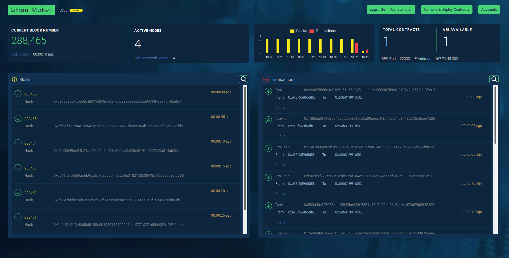
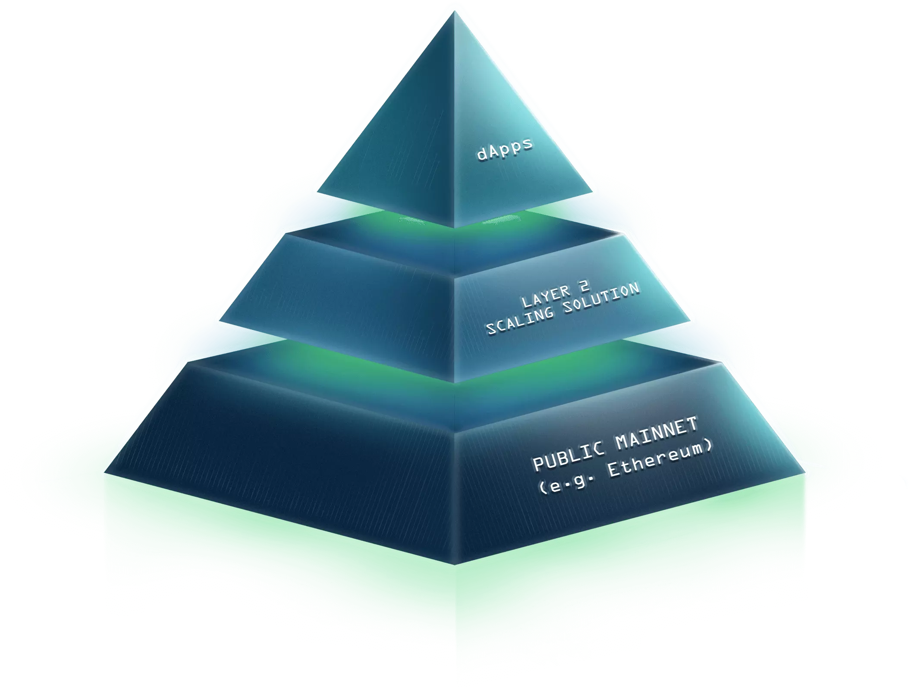

# PowerChain Sidechain Maker v1.0

PowerChain node maker is a tool that allows users to create and manage PowerChain Sidechains networks. It is based on [Synechron's Quorum Maker](https://github.com/synechron-finlabs/quorum-maker).

Manually editing configuration files and creating nodes is a slow and error-prone process. PowerChain can create any number of nodes of various configurations dynamically with reduced user input. This provides a wizard-like interface with a series of questions to guide the user when creating nodes. PowerChain can create nodes to:

- run with docker-compose (BFT consensus/PowerChain v1.0.0) for easy use in development environments; or,
- nodes to be distributed on separate Linux boxes or cloud instances for a production environment (BFT consensus/PowerChain 1.0.0)




## PowerChain provides the following benefits:

1. Maker provides the following benefits:
2. An easy interface to create and manage the PowerChain Network
3. A modern UI to monitor and manage PowerChain Network
4. A Network Map Service to be used for identifying nodes and self-publishing roles.
5. Block and Transaction Explorer
5. Smart Contract Deployment
7. Email Notifications


## Quickstart

For quick help, run `./setup.sh --help` 

```

Version  Built on PowerChain sidechain


Usage ./setup.sh [COMMAND] [OPTIONS]

Utility to setup PowerChain Network

Commands:
create            Create a new Node. The node hosts PowerChain sidechain, Constellation and Node Manager
join as validator Create a node and Join as validator to existing PowerChain sidechain network
join              Create a node and Join to existing PowerChain sidechain network

Options:

For create command:
  -n, --name              Name of the node to be created
  --ip                    IP address of this node (IP of the host machine)
  -r, --rpc               RPC port of this node
  -w, --whisper           Discovery port of this node
  -c, --constellation     Constellation port of this node
  --nm                    Node Manager port of this node
  --ws                    Web Socket port of this node
  -t, --tessera           Create node with Tessera Support (Optional)
  -pk|--privKey           Private key of node (Optional)
  -en|--ethnet            Ethereum network
  -cid|--chainId          Chain ID in PowerChain Ethereum smart-contract to interact with
NOTE if key is not provided, node keys will be generated

E.g.
./setup.sh create -n powerchain --ip 10.0.2.87 -r 22000 -w 22001 -c 22002 --nm 22003 --ws 22004 --ethnet ropsten --chainId 0

For join as validator command:
  -n, --name              Name of the node to be created
  --oip                   IP address of the other node (IP of the existing node)
  --onm                   Node Manager port of the other node
  --tip                   IP address of this node (IP of the host machine)
  -r, --rpc               RPC port of this node
  -w, --whisper           Discovery port of this node
  -c, --constellation     Constellation port of this node
  --nm                    Node Manager port of this node
  --ws                    Web Socket port of this node
  -t, --tessera           Create node with Tessera Support (Optional)
  -pk|--privKey           Private key of node (Optional)
  -en|--ethnet            Ethereum network
  -cid|--chainId          Chain ID in Nordic Energy Ethereum smart-contract to interact with
NOTE if key is not provided, node keys will be generated

E.g.
./setup.sh join_as_validator -n nordicenergy1 --oip 10.0.2.87 --onm 22003 --tip 10.0.2.87 -r 22000 -w 22001 -c 22002 --nm 22003 --ws 22004 --ethnet ropsten --chainId 1

For join command:
  -n, --name              Name of the node to be created
  --oip                   IP address of the other node (IP of the existing node)
  --onm                   Node Manager port of the other node
  --tip                   IP address of this node (IP of the host machine)
  -r, --rpc               RPC port of this node
  -w, --whisper           Discovery port of this node
  -c, --constellation     Constellation port of this node
  --nm                    Node Manager port of this node
  --ws                    Web Socket port of this node
  -t, --tessera           Create node with Tessera Support (Optional)
  -pk|--privKey           Private key of node (Optional)
  -en|--ethnet            Ethereum network
  -cid|--chainId          Chain ID in Nordic Energy Ethereum smart-contract to interact with
NOTE if key is not provided, node keys will be generated

E.g.
./setup.sh join -n nordicenergy1 --oip 10.0.2.87 --onm 22004 --tip 10.0.2.87 -r 22000 -w 22001 -c 22002 --nm 22003 --ws 22004 --ethnet ropsten --chainId 1

-h, --help              Display this help and exit
```

Example output:


## Further Reading
More information can be found in the [Nordic Energy Whitepaper](https://www.nordicenergy.io/docs/Nordic_Energy_Whitepaper_V1.0.0_public.pdf) section "The Blockchain Energy Infrastructure", page 8-30.



## Official Docker Containers

The official docker containers can be found under https://hub.docker.com/nordicenergy/blockchain/powerchain/dev/tags

## References 
* [Documentation](https://gitlab.com/nordicenergy/powerchain-supply-chain/wikis/home)
* [Nprdic Energy](https://gitlab.com/nordicenergy/powerchain)
* [Istanbul BFT Consensus Documentation](https://github.com/ethereum/EIPs/issues/650)
* [Quorum](https://github.com/jpmorganchase/quorum)
* [Quorum Maker](https://github.com/synechron-finlabs/quorum-maker)

## Documentation

You can find many important information on [powerchain-supplychain wiki](https://gitlab.com/nordicenergy/powerchain-supplychain/wikis/home) including tutorials how to join as a validator or transactor, 
how to register a new Sidechain as well as FAQ section.

## License
PowerChain is licensed under the [Apache License](LICENSE), also include in this repository in the `LICENSE` file
